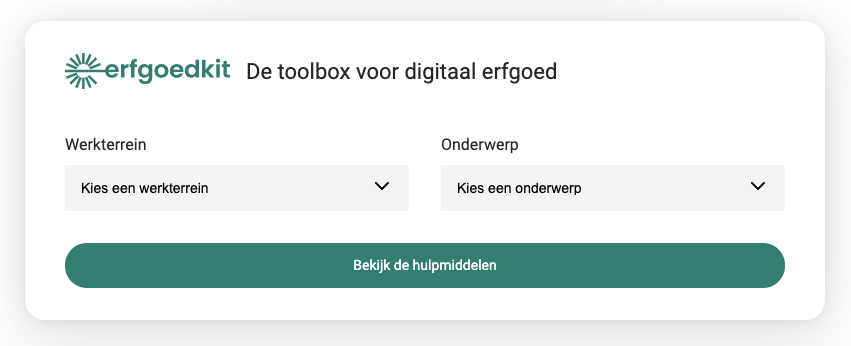

# Erfgoedkit.nl Widget

<!-- Header & Preview Image -->
<h1 align="center">
  
</h1>

Third parties can use this widget to add an interactive link to <a href="https://erfgoedkit.nl">erfgoedkit.nl</a>.

### Developed with ❤️ by [GRRR](https://grrr.nl)

- GRRR is a [B Corp](https://grrr.nl/en/b-corp/)
- GRRR has a [tech blog](https://grrr.tech/)
- GRRR is [hiring](https://grrr.nl/en/jobs/)
- [@GRRRTech](https://twitter.com/grrrtech) tweets

## How to add the widget to your website

### 1. Add an HTML element

Add an HTML element with the data attribute `data-container="nde-widget"` to the
desired location on the page.

#### Example

```html
<div data-container="nde-widget"></div>
```

You can place this element wherever you like. The widget will place itself inside this element. No need to set any size attributes, the widget will ensure it fits inside the given box.

It's also possible to add multiple widgets on the same page.

### 2. Include the styles in your head

#### Example

```html
<link rel="stylesheet" href="https://widget.erfgoedkit.nl/v2.0.1/style.css" />
```

### 3. Include the script in your body

#### Example

```js
<script src="https://widget.erfgoedkit.nl/v2.0.1/script.js"></script>
```

This script will insert the Widget inside the desired element.

## Contact or bugs

For question or bug-reports you can create a new issue.

## Contribute

Configure the URL to the API:

```shell
cp .env.example .env
```

Start the build server:

```shell
yarn dev

# Output:
# Server running at https://localhost:1234
```

Open the provided url in your browser.
